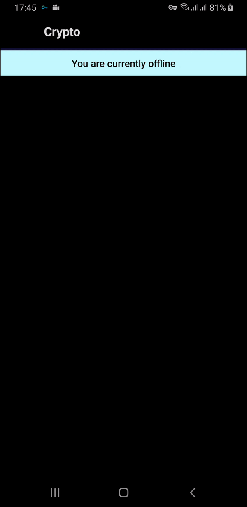

# Sample clean mvvm application that uses Web Socket

  

- [Coroutines](https://developer.android.com/kotlin/coroutines) and flows
- [Room Persistence Library](https://developer.android.com/training/data-storage/room "Room Persistence Library")
- Dependency Injection With Hilt Library.
- Clean Architecture approach.
-  [Scarlet](https://github.com/Tinder/Scarlet "Web Socket Library"

## Demo

 
